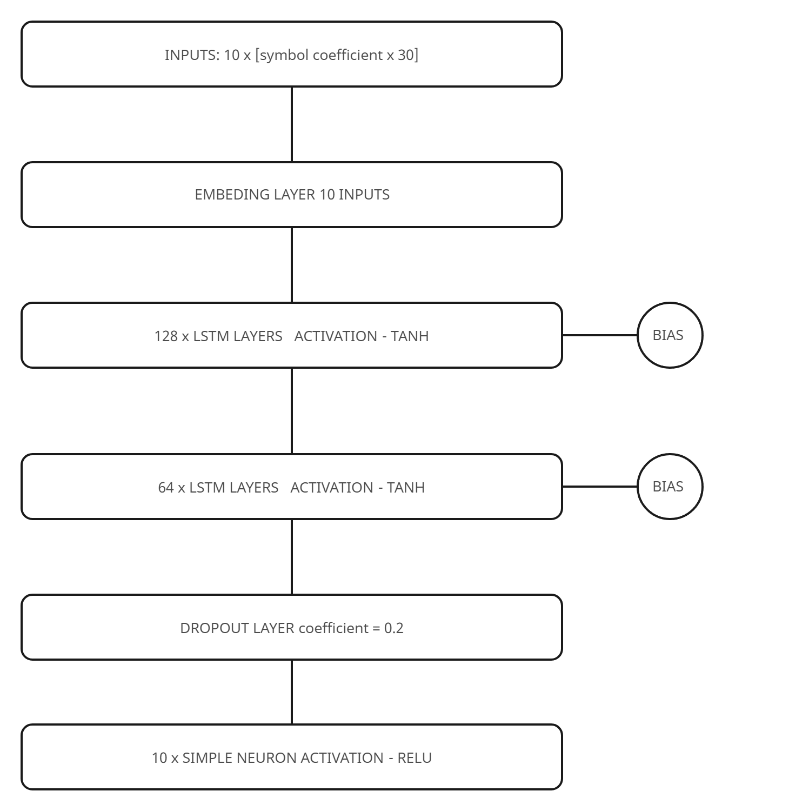
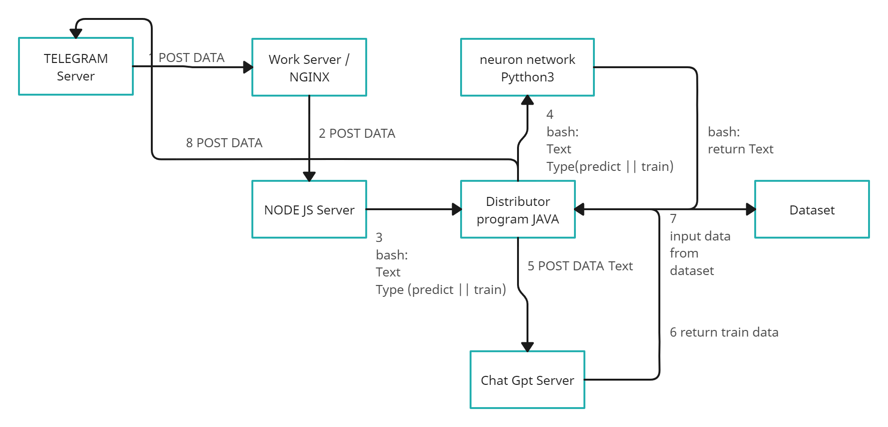

# MATRIX AI CHAT #
This project was created as an individual project at the school.
The goal of this project is to gain practical skills in the field of machine learning.

Tensorflow, keras was used as the main machine learning python library. In addition to this, the project uses Node js, Java as minor languages.

This neural network is presented as a Telegram chat bot @Al_NEED_BOT.

## Description of work ##

Python project modules:

```
pip install numpy
pip install -U scikit-learn
pip install tensorflow
pip install keras
```

Install phantomjs
```
sudo apt-get install gsfonts-x11 fonts-arphic-uming
cd /tmp/ && wget https://bitbucket.org`curl -s https://bitbucket.org/ariya/phantomjs/downloads/ | grep -E -o '/ariya/phantomjs/downloads/phantomjs-[0-9.-]{3,}-linux-x86_64.tar.bz2' | head -n 1` && tar xjf phantomjs-* && sudo mv `ls | grep 'phantomjs-' | head -n 1`/bin/phantomjs /usr/bin/ && cd `ls | grep 'phantomjs-' | head -n 1` && sudo mkdir /usr/share/phantomjs && sudo mv examples/ /usr/share/phantomjs && cd
sudo ln -s /usr/bin/phantomjs /usr/local/bin/phantomjs
sudo ln -s /usr/bin/phantomjs /usr/local/share/phantomjs
```
# neural network architecture #


# system architecture #


